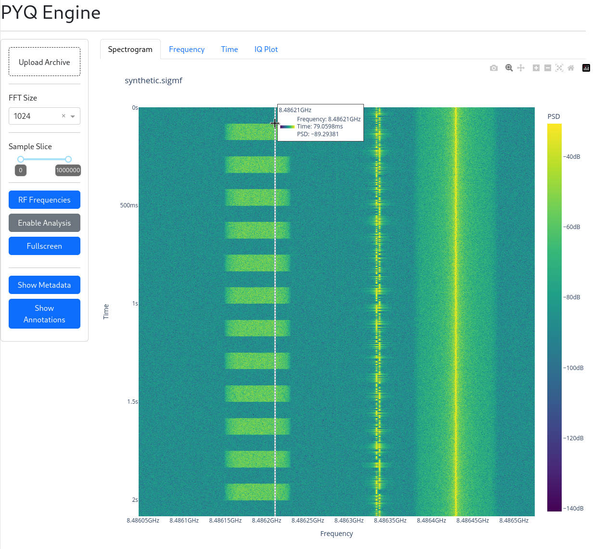
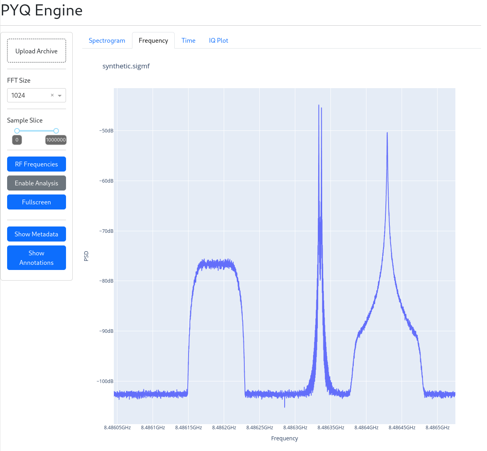

PYQ-Engine
==========
PYQ-Engine is web application meant to visualize SigMF files.
It is heavily inspired by iqengine.org, and mostly reimplemented in Python.

Quick Start
===========

PYQ-Engine uses poetry to manage dependencies and depends on Python >=3.9

As an example, the following should get things running on Ubuntu 20.04 and
later.

.. code-block::

   $ sudo pipx install poetry
   $ sudo apt install python3.9
   $ python3.9 -m virtualenv venv
   $ source ./venv/bin/activate
   (venv) $ poetry install
   ...
   (venv) $ pyq-engine --help
   usage: pyq-engine [-h] [--debug | --no-debug] [--default-tab {spectrogram,frequency,iq}] [--fft-size-options FFT_SIZE_OPTIONS]

   optional arguments:
     -h, --help            show this help message and exit
     --debug, --no-debug
     --default-tab {spectrogram,frequency,iq}
     --fft-size-options FFT_SIZE_OPTIONS

   (venv) $ pyq-engine
   Dash is running on http://0.0.0.0:8050/

    * Serving Flask app 'pyq_engine.app'
    * Debug mode: on

Screenshots
===========

